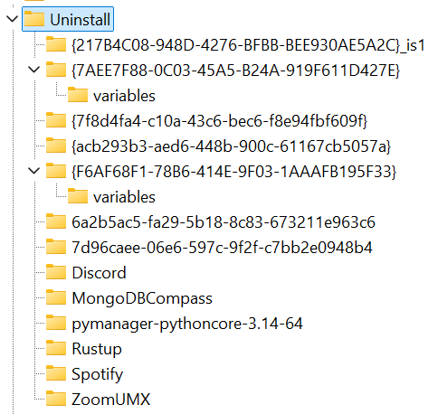

# System Paths Cleaner

A handy Windows 11 CLI tool, executable as a command, to clean up several locations throughout the system.


## Registry Locations

#### User-Specific Path
```
HKEY_CURRENT_USER\Software\Microsoft\Windows\CurrentVersion\Uninstall
```


#### System-Wide Path
```
HKEY_LOCAL_MACHINE\SOFTWARE\Microsoft\Windows\CurrentVersion\Uninstall
```

#### 32-bit App Path
```
HKEY_LOCAL_MACHINE\SOFTWARE\WOW6432Node\Microsoft\Windows\CurrentVersion\Uninstall
```

If there's more I didn't mention here, implement those too.


## Cleanup Options

#### Registry Cleanup
The script goes through all subkeys of all entries (recursively) in the registry locations and deletes all entries, including all their subkeys, if the therein specified uninstaller or other paths can't be located.

#### Environment Variables Cleanup
The script goes through all environment variables, and if a variable's value contains one or more paths, it deletes all paths from the value that couldn't be located.

#### Shortcut-Files Cleanup
The script goes through the startup, start menu, and other such folders of both the user and the global ones and deletes all shortcuts that can't be resolved. It also recursively goes through all subfolders inside those directories and removes unresolvable shortcuts from there, or the whole directory, if all shortcuts in that directory and subdirectories of that directory couldn't be resolved.

#### Other Cleanup
Add more locations that the script can clean up if you find/know some that you think would be useful to have such a functionality for.


## Script Flow

1.  The user chooses if he wants to clean the uninstaller paths from the registry or the paths in the env vars or both (or whatever other options you might add; he also would like to clean up or not).

2.  The script makes backups of what the user decided to clean, saves them all to one place, and tells the user where they were saved. (If a backup fails, we alert that and don't allow the script to continue!)

3.  The script searches through the registry, env vars, etc., and saves what it thinks can be removed (as paths in the registry, as env var names with value position if the var contains multiple paths, etc.).
    ⭢ This step doesn't need to be very verbose.

4.  The script shows a summary to the user of exactly what it will modify/delete in the registry, env vars, etc., and only continues if the user confirms this (otherwise, exit).

5.  If the user confirmed, we actually remove all the registry entries, entire env vars or just parts of the env var values, etc.
    ⭢ If any operation fails, we save the failed operation somewhere to show at the end but continue to attempt executing the rest of the operations.
    ⭢ This step should be pretty verbose.

6.  We now show the user that the script is finished, and if there were any failures, we show those in a small summary.


## Backups

For the registry, we create a full registry backup. I don't think we need to add a restore option to restore such a backup to the script, as a registry backup should be simple to restore via the registry.

For the env vars, I don't know if there actually is a native way to create a backup. If so, we do that; else, we just save all env vars and their values nicely structured into a file (e.g., JSON or whatever makes the most sense here) and then also need to add a simple way to restore those custom backups.

For the shortcut files, I don't think we need a backup, since they aren't as sensitive, and if we remove a shortcut that would later be used again, the user can easily add the shortcut back by hand.

For whatever other cleanup you add that is not inside the registry or env vars, also use a native or custom backup, and add a restore option to the script for non-native backups.


## Script Tools

As the main tool for pretty printing to the console, I want you to use the `xulbux` Python library (installed already). Please read the [**library docs**](https://github.com/xulbux/python-lib-xulbux/wiki) and don't just write code using this library without knowing how exactly.
With this library you can also easily access paths like the script's directory to save the backups in there (maybe in a folder `backups` in the script directory) as a `pathlib.Path` object, using the `xulbux.FileSys.script_dir` and other such class properties.
To see how I use this lib, see the script [`x-rm`](../x-rm.py) I once wrote using it.

For everything that has to do with file/directory/etc. paths, I want you to work with the `Path` form `pathlib`.

For the rest of the tools, you can decide what is best to use and simply install them using `py -m pip install …`.
